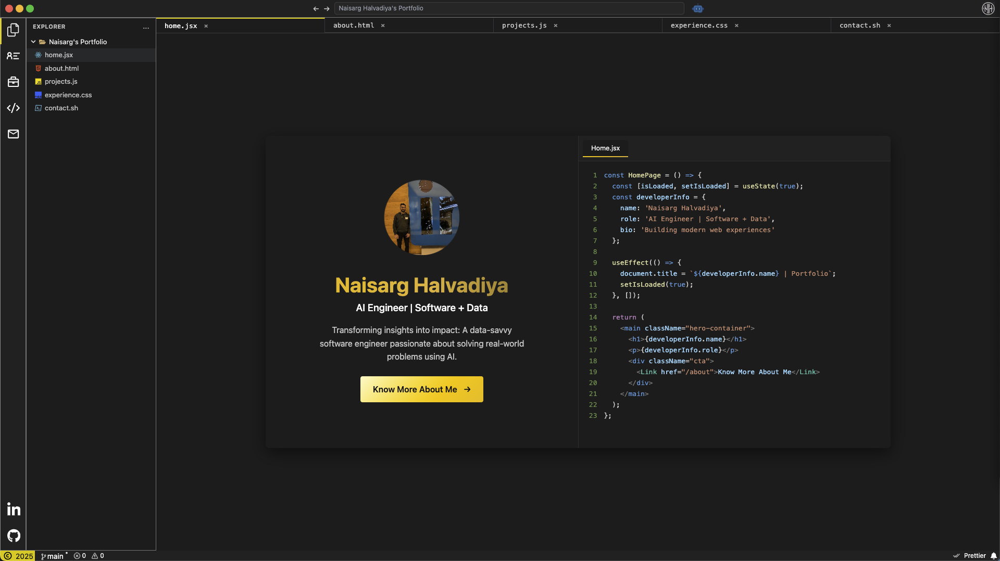

# 🚀 VSCode-Themed Portfolio

## 🎯 About This Project

This is my **VSCode-themed interactive portfolio** that showcases my development journey, projects, and skills in a familiar code editor interface. I built this with React and styled it to look like my favorite IDE - VSCode!

<div align="center">
  
  <br>
  <em>✨ Interactive VSCode-themed interface with real-time features</em>
</div>

---

## ✨ Features

### 🎨 **VSCode-Inspired Design**
- **Dark theme** with syntax highlighting
- **File explorer** navigation
- **Terminal-style** interactions
- **Code editor** aesthetics

### 📱 **Interactive Elements**
- **Real-time GitHub** integration
- **Dynamic project** showcases
- **Responsive design** for all devices
- **Smooth animations** and transitions

### 🛠 **Technical Features**
- **React 19** with modern hooks
- **GitHub API** integration
- **Responsive CSS** with Tailwind
- **Performance optimized**

---

## 🚀 Quick Start

### Prerequisites
```bash
node >= 16.0.0
npm >= 8.0.0
```

### Installation
```bash
# Clone the repository
git clone https://github.com/nh0397/VSCode-Themed-Portfolio.git

# Navigate to project directory
cd VSCode-Themed-Portfolio

# Install dependencies
npm install

# Start development server
npm start
```

### Build for Production
```bash
npm run build
```

---

## 🎨 **Easy Customization - One File to Rule Them All!**

### 📝 **Main Configuration File**
Everything in my portfolio is centralized in one file: **`src/config/portfolioConfig.js`**

Feel free to clone this repository and customize it as per your use. Everything you need to change is in this single configuration file:

```javascript
// ========================================
// PORTFOLIO CONFIGURATION FILE
// ========================================
export const portfolioConfig = {
  // Personal Information
  personal: {
    name: "YOUR NAME",
    title: "Your Title",
    bio: "Your bio...",
    // ... more personal details
  },

  // Skills & Technologies
  skills: {
    frontend: [...],
    backend: [...],
    // ... more skill categories
  },

  // Featured Projects
  featuredProjects: [
    {
      title: "Your Project",
      subtitle: "Project Description",
      // ... project details
    }
  ],

  // Work Experience
  experience: [
    {
      company: "Company Name",
      role: "Your Role",
      // ... experience details
    }
  ],

  // Education
  education: [
    {
      degree: "Your Degree",
      institution: "University Name",
      // ... education details
    }
  ],

  // Achievements & Awards
  achievements: [
    {
      title: "Your Achievement",
      // ... achievement details
    }
  ]
};
```

### 🔧 **What You Can Customize:**

#### **Personal Information**
- Name, title, bio, photo
- Contact information (email, LinkedIn, GitHub)
- Location and social links

#### **Skills & Technologies**
- Frontend, Backend, DevOps, Database, Tools
- Each skill with name and icon URL
- Organized by categories

#### **Featured Projects**
- Project titles, descriptions, problems, solutions
- Impact metrics and future plans
- Tech stack and GitHub links
- Media (images, GIFs, YouTube videos)

#### **Work Experience**
- Company names, roles, durations
- Company logos and locations
- Detailed project descriptions
- Impact metrics and tech stacks

#### **Education**
- Degrees, institutions, GPAs
- University logos and graduation dates

#### **Achievements & Awards**
- Award titles and descriptions
- Project details and tech stacks

#### **Theme & Styling**
- Color scheme (primary, secondary, accent colors)
- Background colors and fonts

---

## 🏗 Project Structure

```
src/
├── config/
│   └── portfolioConfig.js      # 🎯 MAIN CONFIGURATION FILE
├── components/
│   ├── Content/
│   │   └── Files/              # Main content components
│   │       ├── About.jsx
│   │       ├── Projects.jsx
│   │       ├── FeaturedProjects.jsx
│   │       └── Experience.jsx
│   ├── Sidebar/                # File explorer sidebar
│   └── Terminal/               # Terminal component
├── assets/
│   └── images/                 # Project images and GIFs
├── context/                    # React context providers
└── services/                   # API services
```

---

## 🎯 Featured Projects

### 🔒 **Secure Sense** - GenAI-Aware DLP Tool
*Real-time data loss prevention for AI tools*

<div align="center">
  
</div>

**Tech Stack:** React, Flask, Ollama, Python, JavaScript, Edge-AI, Native LLM

### 🤖 **RAG Chatbot Buddy** - Personalized AI Assistant
*Chatbot trained on your personal data*

**Tech Stack:** LangChain, Pinecone, Gemini API, MongoDB, React, Node

### 📊 **FlareGraph** - SF Fire Incident Visualizer
*Interactive fire data visualization*

**Tech Stack:** Dash, Plotly, Python, Geospatial Clustering

### 📈 **StockBot AI** - Inventory Anomaly Detection
*ML-powered inventory monitoring*

**Tech Stack:** Vertex AI, MongoDB, Python, FastAPI, CI/CD

### 🎓 **EduBridge** - Emotion-Aware LMS
*Learning management with emotional intelligence*

**Tech Stack:** React.js, Node.js, AWS, MySQL, Directus CMS

---

## 🛠 Tech Stack

<div align="center">
  
  
  
  
  
  
  
  
</div>

### **Frontend**
- **React 19** - Modern React with hooks
- **Tailwind CSS** - Utility-first CSS framework
- **React Icons** - Beautiful icon library
- **React Syntax Highlighter** - Code highlighting

### **APIs & Services**
- **GitHub API** - Repository data integration
- **GitHub Calendar** - Contribution visualization
- **Octokit GraphQL** - Advanced GitHub queries

### **Development Tools**
- **Create React App** - Development environment
- **ESLint** - Code quality
- **Jest** - Testing framework

---

## 🎨 **Customization Guide**

### **Step 1: Update Personal Information**
```javascript
// In src/config/portfolioConfig.js
personal: {
  name: "Your Name",
  title: "Your Professional Title",
  bio: "Your professional bio...",
  photo: "../assets/images/your-photo.jpg",
  email: "your.email@example.com",
  linkedin: "https://linkedin.com/in/your-profile",
  github: "https://github.com/your-username"
}
```

### **Step 2: Add Your Projects**
```javascript
featuredProjects: [
  {
    title: "Your Amazing Project",
    subtitle: "What it does",
    problem: "The problem it solves",
    solution: "How you solved it",
    impact: [
      "Impact point 1",
      "Impact point 2"
    ],
    tech: ["React", "Node.js", "Python"],
    github: "https://github.com/your-username/project",
    media: {
      type: "youtube", // "image", "gif", "youtube"
      url: "video-id", // YouTube video ID or image URL
      alt: "Project description"
    }
  }
]
```

### **Step 3: Update Work Experience**
```javascript
experience: [
  {
    type: "work",
    company: "Your Company",
    logo: "https://company-logo-url.com/logo.png",
    role: "Your Role",
    duration: "Jan 2023 - Present",
    location: "City, Country",
    description: "What you do",
    projects: [
      {
        title: "Project Name",
        description: "What you built",
        impact: ["Impact 1", "Impact 2"],
        stack: ["Tech 1", "Tech 2"]
      }
    ]
  }
]
```

### **Step 4: Add Your Skills**
```javascript
skills: {
  frontend: [
    { name: "React", icon: "https://icon-url.com/react.svg" }
  ],
  backend: [
    { name: "Node.js", icon: "https://icon-url.com/nodejs.svg" }
  ]
  // ... more categories
}
```

### **Step 5: Customize Theme Colors**
```javascript
theme: {
  primaryColor: "#ffea00",    // Your brand color
  secondaryColor: "#9f7aea",  // Secondary color
  accentColor: "#ff6b6b",     // Accent color
  backgroundColor: "#1e1e1e", // Background
  cardBackground: "#2a2a2a"   // Card background
}
```

---

## 📊 GitHub Integration

My portfolio automatically fetches and displays:
- **Repository list** from GitHub API
- **Contribution calendar** visualization
- **Real-time project** statistics
- **Dynamic content** updates

**Update GitHub username in config:**
```javascript
github: {
  username: "your-github-username",
  apiUrl: "https://api.github.com/users/your-github-username/repos"
}
```

---

## 🚀 Deployment

### Netlify (Recommended)
```bash
# Build the project
npm run build

# Deploy to Netlify
# Connect your GitHub repository to Netlify
# Set build command: npm run build
# Set publish directory: build
```

### Vercel
```bash
# Install Vercel CLI
npm i -g vercel

# Deploy
vercel
```

---

## 🤝 Contributing

1. **Fork** the repository
2. **Create** a feature branch (`git checkout -b feature/AmazingFeature`)
3. **Commit** your changes (`git commit -m 'Add some AmazingFeature'`)
4. **Push** to the branch (`git push origin feature/AmazingFeature`)
5. **Open** a Pull Request

---

## 📝 License

This project is licensed under the MIT License - see the [LICENSE](LICENSE) file for details.

---

## 🙏 Acknowledgments

- **VSCode** for being my favorite code editor and providing the amazing IDE design inspiration
- **GitHub** for the comprehensive API
- **React community** for the excellent ecosystem
- **Tailwind CSS** for the utility-first approach

---

<div align="center">
  
  ### **Let's Connect!** 🤝
  
  [](https://linkedin.com/in/naisarg-h)
  [](https://github.com/nh0397)
  [](mailto:naisarg.halvadiya@gmail.com)
  
  **⭐ Star this repository if you found it helpful!**
  
</div>
